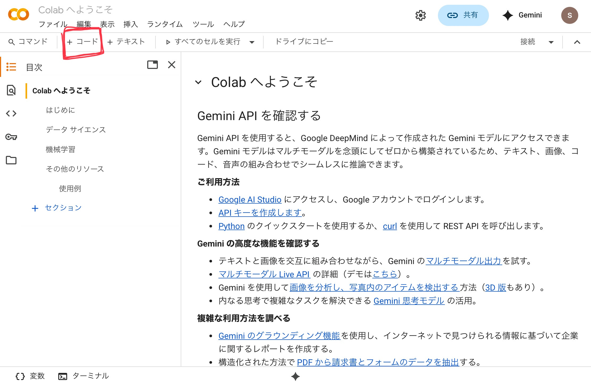

# Python実行環境

一番最初に勉強する言語はPythonです。AIなどの研究分野でよく使われる言語で最近ではよく使われているので勉強しておいて損はありません。実際に最も有名な言語と言われています。[^note1]

[^note1]: [TIOBEによる統計](https://www.tiobe.com/tiobe-index/)より（2025/9/20現在の情報）

このPythonの章は、「Pythonを学ぶ」ではなく「Pythonで学ぶ」構成となっています。Pythonの学習というよりかはPythonを通して各種プログラミング言語に共通する基本的な概念を理解することを目指しています。

Pythonは筆者が嫌いな言語ではありますが筆者が一番初めに学んだ言語でもあります。安心してください。とても簡単です。

>以下の内容は[Google Colab の準備: ゼロからのPython入門講座 - python.jp](https://www.python.jp/train/experience/colab.html)と同時に読み進めることをお勧めします。

プログラマが新しく言語を学ぶ上で最初にすることは、実行環境の整備とHello Worldです。
あなたはもはやプログラマなのですから、それに倣って実行環境の整備から始めましょう！

## 実行環境の整備
Python学習に必要な実行環境を用意しましょう。Pythonをパソコンにインストールする方法を紹介することも可能ですが、それに詰まってしまったらあなたがプログラミングに挫折してしまいそうなのでもっと簡単な方法を紹介します。
それは[GoogleColab](https://colab.research.google.com/)というWebサービスを利用することです。無料なので安心して利用してください。

[https://colab.research.google.com/](https://colab.research.google.com/)

上記のURLにアクセスしたら実行環境の整備は完了です。
もしかしたらGoogleにログインするよう迫られるかもしれません。Googleアカウントの作成方法やログイン方法はこの本の範疇を超えるので解説しません。Web上で素晴らしい文献が見つかるでしょう。

## Hello World
では`Hello World`を行いましょう。`Hello World`とは何ですか？`Hello World`はプログラマがその言語きちんと動作することを確認するためにしばしばする行為です。具体的には単に`Hello World`とだけ出力するプログラムを動かすことです。
`Hello World`は「こんにちは世界」という意味ですが、特に理由はありません。[^note2]

[^note2]: 「[どうしてHello, World!なの？](https://web.hazu.jp/hello-world/)」という記事がありました。興味があったらどうぞ。



赤い印をしている`+コード`というボタンを押してコードブロック（プログラムを書く場所）を新しく作成しましょう。続けて以下の`Hello World`プログラムを手打ちもしくはコピ＆ペーストしてください。

```python
# 初めてのHello Worldプログラム
print("Hello World")
```

コードブロックの左にある`▶️`ボタンを押して`Hello World`を実行してください。最初は少し時間がかかりますが、すぐ下のブロックに結果が表示されます。"Hello World"というテキストをprintするよう指示をしたので、以下のように表示されたら成功です。

```
Hello World
```

もし`▶️`ボタンが真っ赤になり`Hello World`と表示されない場合は、もう一度タイプミスがないか確認してください。特に丸括弧やクオテーションマーク（"）が全角ではなく半角で入力されていることを確認してください。コンピュータは厳格なので少しでも違ったら「わかんない！」とエラーを吐き出してしまいます。

このからあなたはバリバリプログラムを書いていくわけなのでたくさんのエラーに遭遇する可能性が高いです。そうなる前に一般的にエラーに対してどのように対処すればいいか体系的にまとめておきましょう。

---

同時に読み進める（必須）：
[Google Colab の準備: ゼロからのPython入門講座 - python.jp](https://www.python.jp/train/experience/colab.html)

発展・辞書（任意）：
[Python公式ドキュメント和訳](https://docs.python.org/ja/3.13/)
